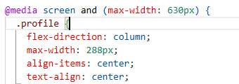

# Project 3: Spots

A interactive photo galleray that allows users to upload their photos and like photos uploaded by other users.

## Project & Functionality

- HTML
- CSS
- Responsive Design
- Figma
- Images

**Intro**

This project is made so all the elements are displayed correctly on popular screen sizes from mobile screens at 327px to desktops greater than 1440px.

**Figma**

- [Link to the project on Figma](https://www.figma.com/file/BBNm2bC3lj8QQMHlnqRsga/Sprint-3-Project-%E2%80%94-Spots?type=design&node-id=2%3A60&mode=design&t=afgNFybdorZO6cQo-1)

**Images**

Images and icons were extracted from Figma to create the website using the desktop first method.

**Responsive Design**

The ability to do responsive design was done with the use of @media queries on various elements so everything transitions seemlesslessly betwwwen screen sizes.

## Deployment

This webpage is deployed to GitHub Pages:

- Deployment Link: https://ArtificialF9.github.io/se_project_spots
